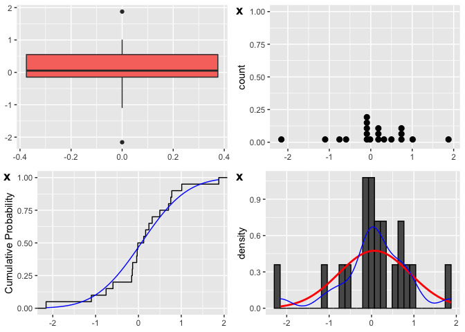
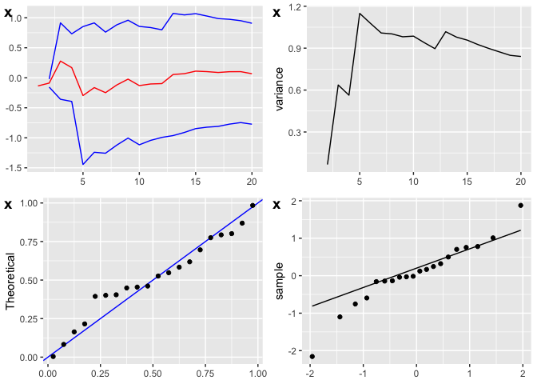
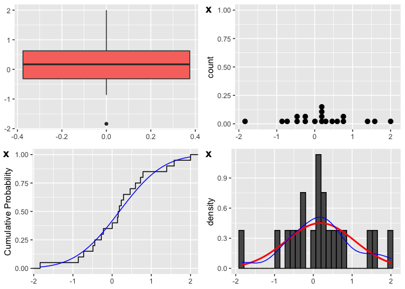
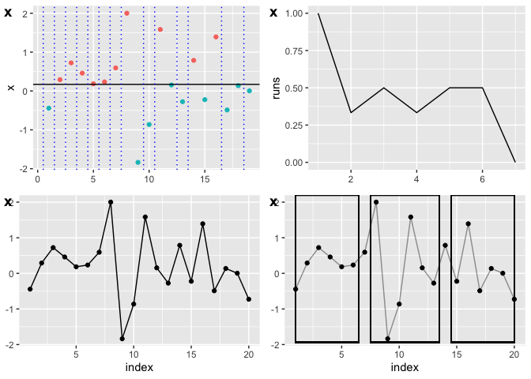

<!-- README.md is generated from README.Rmd. Please edit that file -->

The purpose of the ‘assumptions’ R-package is threefold:

  - It tries to raise awareness of statistical assumptions. Before
    conducting a statistical test, its assumptions are printed to the
    console and the user is asked for confirmation after a graphical
    assessment.

  - It collects tests and graphs to assess statistical assumptions and
    simplifies looking up specific assumptions.

  - All the tests are made available for simulations including complex
    decision strategies for picking a statistical test for different
    diagnosed assumption violations.

## Install package

To install ‘assumptions’ R-package from github run:

``` r
require(remotes)
remotes::install_github("animalSymbolicum/assumptions")
library(assumptions)
```

## Hypothesis Tests

The assumptions package seeks to expand common statistical methods with
the notice of their assumptions for educational purpose. To conduct a
parametric or non-parametric hypothesis test call:

``` r
# t-test
asm_ttest(rnorm(20), color = F)
#> The asm_ttest makes three assumptions for the input variable(s) x (and y):
#>  I  ) the sample distribution is normal or the sample size is big enough that 
#>         the distribution of the sample means likely converge to normal.
#>  II ) are identically distributed, which means each value comes from the same distribution.
#>  III) are independent, which means each value is not influenced by any other value. 
#>         As two paired variables are used (paired=T) the pairs are dependent but 
#>         values between pairs still must be independent.
#> ***********************************************************************************
#> If you confirm to acknowledge that under violation(s) of the assumptions the t-test
#> the t-test results might be wrong.
#> Press [enter] to confirm
```



    #> Press [enter] for the next plot



    #> Press [enter] for the next plot


    #> Press [enter] to run Welch-Test - if you are convinced your data fulfills the assumptions.
    #> 
    #>  One Sample t-test
    #> 
    #> data:  x
    #> t = 0.35822, df = 19, p-value = 0.7241
    #> alternative hypothesis: true mean is not equal to 0
    #> 95 percent confidence interval:
    #>  -0.3260519  0.4607036
    #> sample estimates:
    #>  mean of x 
    #> 0.06732585

``` r
# wilcoxon test
asm_wilcox(rnorm(20), color = F)
#> If paired = FALSE - 
#> the asm_wilcox makes three assumptions for the input variable(s) x (and y):
#>  I  ) are at least ordinal scaled. 
#>  II ) are identically distributed, which means each value comes from the same distribution.
#>  III) are independent, which means each value is not influenced by any other value. 
#>         As two paired variables are used (paired=T) the pairs are dependent but 
#>         values between pairs still must be independent.
#> If paired = TRUE - 
#> the asm_wilcox makes four assumptions for the input variable(s) x (and y):
#>  I  ) are at least interval scaled. 
#>  II ) the distribution of the calculated differences is symmetric.
#>  III) are identically distributed, which means each value comes from the same distribution.
#>  IV ) are independent, which means each value is not influenced by any other value.
#> ******************************************************************************************
#> If you confirm to acknowledge that under violation(s) of the assumptions the wilcoxon test
#> the wilcoxon results might be wrong.
#> Press [enter] to confirm
```



    #> Press [enter] for the next plot


    #> Press [enter] for the next plot



    #> Press [enter] to run wilcoxon test - if you convinced your data fulfills the assumptions
    #> 
    #>  Wilcoxon signed rank exact test
    #> 
    #> data:  x
    #> V = 129, p-value = 0.3884
    #> alternative hypothesis: true location is not equal to 0

## Look Up assumptions

Common statistical methods assumptions can be looked up with:

``` r
# get assumptions of t.test
assumptions(t.test, color = F)
#> The t.test makes three assumptions for the input variable(s) x (and y):
#>  I  ) the sample distribution is normal or the sample size is big enough that 
#>         the distribution of the sample means likely converge to normal.
#>  II ) are identically distributed, which means each value comes from the same distribution.
#>         As two variables are used, the two variables can have two different distributions if 
#>         the Welch Test is used (var.equal=F).
#>  III) are independent, which means each value is not influenced by any other value. 
#>         As two paired variables are used (paired=T) the pairs are dependent but 
#>         values between pairs still must be independent.
```

``` r
# get assumptions of wilcox.test
assumptions(wilcox.test, color = F)
#> If paired = FALSE - 
#> the wilcox.test makes three assumptions for the input variable(s) x (and y):
#>  I  ) are at least ordinal scaled. 
#>  II ) are identically distributed, which means each value comes from the same distribution.
#>  III) are independent, which means each value is not influenced by any other value. 
#>         As two paired variables are used (paired=T) the pairs are dependent but 
#>         values between pairs still must be independent.
#> If paired = TRUE - 
#> the wilcox.test makes four assumptions for the input variable(s) x (and y):
#>  I  ) are at least interval scaled. 
#>  II ) the distribution of the calculated differences is symmetric.
#>  III) are identically distributed, which means each value comes from the same distribution.
#>  IV ) are independent, which means each value is not influenced by any other value.
```

## Overview of assumptions assessment tests (pre-tests)

All tests and graphs to assess specific assumptions such as the
distribution, independence, identical distribution (homogeneity) or
randomness are collected in a central catalogue table.

``` r
asm_library()
#>       Assumption                              Name     Package      Help
#>  1: distribution                        Lilliefors       PoweR <list[1]>
#>  2: distribution                  Anderson-Darling       PoweR <list[1]>
#>  3: distribution                D'Agostino-Pearson       PoweR <list[1]>
#>  4: distribution                       Jarque-Bera       PoweR <list[1]>
#>  5: distribution                    Doornik-Hansen       PoweR <list[1]>
#>  6: distribution                     Gel-Gastwirth       PoweR <list[1]>
#>  7: distribution                       1st Hosking       PoweR <list[1]>
#>  8: distribution                       2nd Hosking       PoweR <list[1]>
#>  9: distribution                       3rd Hosking       PoweR <list[1]>
#> 10: distribution                       4th Hosking       PoweR <list[1]>
#> 11: distribution              1st Bontemps-Meddahi       PoweR <list[1]>
#> 12: distribution              2nd Bontemps-Meddahi       PoweR <list[1]>
#> 13: distribution                Brys-Hubert-Struyf       PoweR <list[1]>
#> 14: distribution                      Bonett-Seier       PoweR <list[1]>
#> 15: distribution Brys-Hubert-Struyf & Bonett-Seier       PoweR <list[1]>
#> 16: distribution                      Shapiro-Wilk       PoweR <list[1]>
#> 17: distribution                   Shapiro-Francia       PoweR <list[1]>
#> 18: distribution                Gel-Miao-Gastwirth       PoweR <list[1]>
#> 19: distribution                               R_n       PoweR <list[1]>
#> 20: distribution                           X_{APD}       PoweR <list[1]>
#> 21: distribution                           Z_{EPD}       PoweR <list[1]>
#> 22:   randomness                      Bartels Rank   randtests <list[1]>
#> 23:   randomness                        Cox Stuart   randtests <list[1]>
#> 24:   randomness                   Difference Sign   randtests <list[1]>
#> 25:   randomness                              Rank   randtests <list[1]>
#> 26:   randomness                              Runs   randtests <list[1]>
#> 27:  homogeneity                            F-Test       stats <list[1]>
#> 28:  homogeneity                          Bartlett      ExpDes <list[1]>
#> 29:  homogeneity                            Layard      ExpDes <list[1]>
#> 30:  homogeneity                            Levene      ExpDes <list[1]>
#> 31: independence                        Box-Pierce       stats <list[1]>
#> 32: independence                      Ljung-Pierce       stats <list[1]>
#> 33:          iid       Spanos Auxiliary Regression assumptions <list[1]>
#> 34:  homogeneity                     Graph Boxplot assumptions <list[1]>
#> 35: distribution                     Graph Dotplot assumptions <list[1]>
#> 36: distribution                        Graph ecdf assumptions <list[1]>
#> 37: distribution                   Graph Histogram assumptions <list[1]>
#> 38: distribution               Graph Mean Increase assumptions <list[1]>
#> 39: distribution                    Graph P-P-Plot assumptions <list[1]>
#> 40: distribution                    Graph Q-Q-plot assumptions <list[1]>
#> 41:   randomness                    Graph Randruns assumptions <list[1]>
#> 42:   randomness              Graph Differencesign assumptions <list[1]>
#> 43: independence                      Graph t-Plot assumptions <list[1]>
#> 44: distribution                Graph Var Increase assumptions <list[1]>
#> 45:  homogeneity                      Graph Window assumptions <list[1]>
#>       Assumption                              Name     Package      Help
#>          SimulationName
#>  1:             pre_K_S
#>  2:              pre_AD
#>  3:             pre_K_2
#>  4:              pre_JB
#>  5:              pre_DH
#>  6:             pre_RJB
#>  7:          pre_T_Lmom
#>  8:        pre_T_Lmom_1
#>  9:        pre_T_Lmom_2
#> 10:        pre_T_Lmom_3
#> 11:          pre_BM_3_4
#> 12:          pre_BM_3_6
#> 13:         pre_T_MC_LR
#> 14:             pre_T_w
#> 15:     pre_T_MC_LR_T_w
#> 16:               pre_W
#> 17:         pre_W_Quote
#> 18:            pre_R_sJ
#> 19:             pre_R_n
#> 20:           pre_X_APD
#> 21:           pre_Z_EPD
#> 22:    pre_bartels.rank
#> 23:      pre_cox.stuart
#> 24: pre_difference.sign
#> 25:            pre_rank
#> 26:            pre_runs
#> 27:           pre_ftest
#> 28:        pre_bartlett
#> 29:          pre_levene
#> 30:   pre_oneillmathews
#> 31:      pre_Box.Pierce
#> 32:       pre_Ljung.Box
#> 33:    pre_asm_preJoint
#> 34:                   -
#> 35:                   -
#> 36:                   -
#> 37:                   -
#> 38:                   -
#> 39:                   -
#> 40:                   -
#> 41:                   -
#> 42:                   -
#> 43:                   -
#> 44:                   -
#> 45:                   -
#>          SimulationName
```

## Single assessment of an assumption

Single or combinations of assumptions can be assessed by calls like:

``` r
# only first test selected as example
asm_distribution(rnorm(10), 1)
#>          Name      Help    pvalue
#> 1: Lilliefors <list[1]> 0.8682802
asm_independence(rnorm(10), 1)
#>          Name      Help    pvalue
#> 1: Box-Pierce <list[1]> 0.7579546
asm_randomness(rnorm(10), 1)
#>            Name      Help         stat    pvalue
#> 1: Bartels Rank <list[1]> bartels.rank 0.9004949
asm_homogeneity(list(A=rnorm(10), B=rnorm(10)), 1)
#>      Name      Help    pvalue
#> 1: F-Test <list[1]> 0.8583127

# a combination of tests
asm_preTests(rnorm(10), c("Shapiro-Wilk", "Rank", "Ljung-Pierce"))
#>            Name      Help     pvalue
#> 1: Shapiro-Wilk <list[1]> 0.35093862
#> 2:         Rank <list[1]> 0.53124999
#> 3: Ljung-Pierce <list[1]> 0.05997327
```

## Simulations

These tests are also available for simulations. Simulation can be
defined and summarized by:

``` r
# minimal example
minSim <- asm_simulate(100, pre_selection = c("Shapiro-Wilk", "Rank", "Ljung-Pierce"))
asm_reportSim(minSim, report = "result")
#> $result
#>       sim_func sim_n_X sim_n_Y sim_cell pre_W_X pre_W_Y pre_rank_X pre_rank_Y
#> 1: asm_simData      10      30        1    0.04    0.04       0.04       0.05
#>    pre_Ljung.Box_X pre_Ljung.Box_Y post_welch post_ttest post_wilcox
#> 1:            0.09            0.09       0.04       0.02        0.01
#> 
#> $cross
#> NULL
#> 
#> $description
#> NULL
```

Complex decision strategies can be defined in the simulation call or
afterwards on simulation result:

``` r
# minimal example
asm_simStrategy(minSim, 
  list(
    simple  = quote(ifelse(pre_W_X & pre_W_Y, post_ttest, post_wilcox)),
    complex = quote(ifelse(sim_n_X < 11 & pre_W_X_pvalue <= 0.001 & !descr_skew_X > 1, post_ttest, post_wilcox))
  )
)
asm_reportSim(minSim, report = "result")
#> $result
#>       sim_func sim_n_X sim_n_Y sim_cell pre_W_X pre_W_Y pre_rank_X pre_rank_Y
#> 1: asm_simData      10      30        1    0.04    0.04       0.04       0.05
#>    pre_Ljung.Box_X pre_Ljung.Box_Y post_welch post_ttest post_wilcox
#> 1:            0.09            0.09       0.04       0.02        0.01
#>    strat_simple strat_complex
#> 1:         0.01          0.01
#> 
#> $cross
#> NULL
#> 
#> $description
#> NULL
```

A simulation study like [‘The two-sample t test: pre-testing its
assumptions does not pay
off’](https://doi.org/10.1007/s00362-009-0224-x) could be replicated
with:

``` r
require(miceadds)
asm_simulate(
    simulations = 100000,
    sim_n = list(c(10,30,10,30,30), c(10,30,30,10,100)),
    sim_func = rep("asm_simData", 24),
    sim_args = mapply(function(distr, sig, delta) {
          list(
              distr = c("fleishman_sim",  "fleishman_sim"),
              dots  = list(
                  list(mean = delta, sd = sig, skew = distr[1], kurt = distr[2]),
                  list(skew = distr[3], kurt = distr[4])
              )
          )
      },
      rep(
        list(c(0,0,0,0), c(0,15,0,15), c(0.5,15,0.5,15), c(1,15,1,15), c(3,15,3,15), c(0,0,3,15)),
        4
      ),
      as.list(rep(rep(1:2, each = 6), 2)),
      as.list(rep(c(0, 1), each = 12)),
      SIMPLIFY=FALSE
    )
)
```
